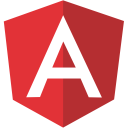

<h2 align="left">
  Welcome to Alessandro's profile!
  
</h2>

<h5 align="lwft">
  <code><a href="https://www.linkedin.com/in/alessandro-buffoli/" title="LinkedIn Profile"> LinkedIn</a></code>
  <code><a href="https://www.instagram.com/alessandrobuffoli/" title="Instagram Profile"> Instagram</a></code>
  <code><a href="https://twitter.com/Aleebuffoli" title="Instagram Profile"> Twitter</a></code>
  <code><a href="https://www.youtube.com/alessandrobuffoli" title="Instagram Profile"> Youtube</a></code>
  <code><a href="https://stackoverflow.com/users/10158519/alessandro-buffoli" title="Stack Overflow Profile"> Stack Overflow</a></code>
</h5>
<br>

Hi, I'm [Alessandro Buffoli](https://alessandrobuffoli.it/), I have always been fascinated by
how things work, since I embarked on this path (about 2017) I realized that programming is the 
tool that allows me to express my ability.
I also enjoy collaborating in team, improve my skills, share with others new points of view and above all creating **coll stuff** :rocket:
<br><br>
<h3>“ I always try, in any way, to accomplish my mission. „</h3>
<br>

___


- Any freelance work? [Contact Me.](mailto:ale.buffoli1@gmail.com) 
- Ask me about anything, I am happy to help;

**Languages and Tools**

<code></code>
<code></code>
<code></code>
<code></code>
<code></code>


<!--START_SECTION:waka-->
```text
I USUALLY CREATE/MANAGE/DO:

API REST     ███████░░░░  60%
O-AUTH 2.0   ███░░░░░░░░  20%
CI/CD        █░░░░░░░░░░   5%
SERVERS      █░░░░░░░░░░   5%
STUDY        ██░░░░░░░░░  10%
```
<!--END_SECTION:waka-->

___

# Stats

<p align=center>
  <div align=center>
    <a href="https://github.com/alebuffoli/github-readme-streak-stats" title="Go to Source">
      
    </a>
    <a href="https://github.com/alebuffoli/github-readme-stats" title="Go to Source">
      
    </a>
  </div>
  <div align=center>
    
  </div>
</p>

<br>
<h4 align="center">Visitors Counter</h4>
<p align="center"> 
  
</p>

<hr>
